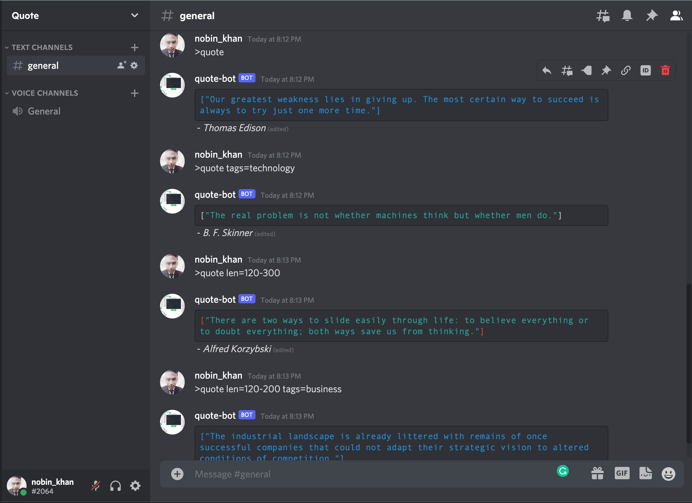

# Discord Quote Bot 🤖

A discord bot that send random quote on command to the Channel.

[](discord-quote-bot)

## Pre-requisites

* [Python >=3 ](https://www.python.org/)
* [disnake>=2.3.0](https://github.com/DisnakeDev/disnake)
* [request](https://github.com/psf/requests)

## Setup

* Clone the repository

    ```bash
    git clone https://github.com/m-nobinur/discord-quote-bot.git
    ```

* Setup an app on discord, [instructions.](https://github.com/reactiflux/discord-irc/wiki/Creating-a-discord-bot-&-getting-a-token)
* Get the bot token<YOUR_BOT_TOKEN>.
* Invite your bot using following link:
  <https://discord.com/oauth2/authorize?&client_id=APPLICATION_ID&scope=bot+applications.commands&permissions=PERMISSIONS_INT>
  > Replace `APPLICATION_ID` with the application ID and replace `PERMISSIONS_INT` with the required permissions integer

* Either set BOT_USER_TOKEN=YOUR_BOT_TOKEN in quote-bot.py or use the token as argument when run the script.

## How to start

Open terminal and go to cloned `discord-quote-bot` folder.

```bash
cd discord-quote-bot
```

Install all the requirements

```bash
pip install -r requirements.txt
```

or

```bash
pip3 install -r requirements.txt
```

<br>

### Run your bot

If you setted BOT_USER_TOKEN variable to your bot token then run the script as following (On Mac/Linux)

```bash
python3 quote-bot.py
```

(On Windows)

```bash
python quote-bot.py
```

### OR

On Mac/Linux

```bash
python3 quote-bot.py <YOUR_BOT_TOKEN>
```

On Windows

```bash
python quote-bot.py <YOUR_BOT_TOKEN>
```

> ℹ️
> Use virtual environment for best practices.

## Available command

| Variable                  | What it is                                                            |
| ------------------------- | ----------------------------------------------------------------------|
| >quote                        | Send random quote to the Channel
| >quote tags=Tag      | Send random quote of given tag.                                             |
| >quote tags=Tag,Tag\|Tag      | Send random quote of given tags.                                             |
| >quote len=Max         | Send random quote of given Max length.
| >quote len=Min-Max  | Send random quote within given Minimum & Maximum length.                                        |
| >quote tags=Tag len=Max                  | The user ID of all the bot owners                                     |

> on tags "," represent "and" and "|" represent "or"
